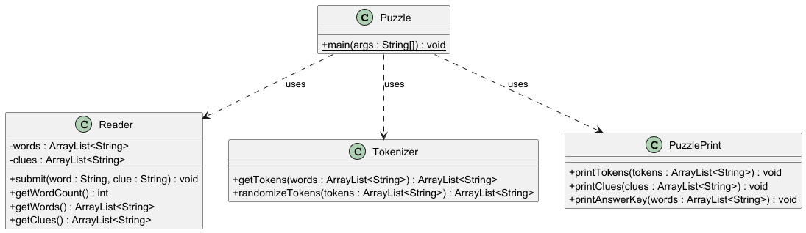

# Six Little Words Puzzle Creator

## Project Overview
The Six Little Words Puzzle Creator is a Java application developed as part of the graduate course CSCA 5428 OOAD Course 1 Capstone Project at the University of Colorado Boulder. This program generates word puzzles based on user-provided words and clues, creating an engaging and educational word game.

## Features
- Accepts 6 words and their corresponding clues from the user
- Tokenizes words into two-letter segments (with the last token potentially being three letters for odd-length words)
- Randomizes the order of tokens to create the puzzle
- Presents the puzzle with randomized tokens, clues, and an answer key

## Project Structure
```
capstone_java_project/
├── src/
│   ├── main/java/com/pgeorgiadis/wordpuzzle/
│   │   ├── Puzzle.java
│   │   ├── Reader.java
│   │   ├── Tokenizer.java
│   │   └── PuzzlePrint.java
│   └── test/java/com/pgeorgiadis/wordpuzzle/
│       └── PuzzleTest.java
├── .gitignore
├── README.md
└── puzzle_class_uml.png
```

## UML Class Diagram
The project includes a UML class diagram (`puzzle_class_uml.png`) in the root directory. This diagram provides a visual representation of the project's structure, including all classes, their associations, methods with types, and accessibility notations. It's a helpful resource for understanding the overall architecture of the Six Little Words Puzzle Creator.



## Setup and Installation
1. Ensure you have Java Development Kit (JDK) installed on your system.
2. Clone this repository to your local machine.
3. Open the project in your preferred Java IDE (e.g., IntelliJ IDEA, Eclipse).

## How to Run
1. Navigate to the `Puzzle.java` file in your IDE.
2. Run the `main` method in the `Puzzle` class.
3. The program will generate a puzzle based on the pre-defined words and clues.
4. The output will display the randomized tokens, clues, and answer key.

## How to Use
To customize the puzzle with your own words and clues:
1. Open the `Puzzle.java` file.
2. Locate the `main` method.
3. Modify the `reader.submit()` calls with your desired words and clues.
4. Run the program to generate a new puzzle with your custom inputs.

## Running Tests
1. Navigate to the `PuzzleTest.java` file in your IDE.
2. Run the tests to ensure all components are functioning correctly.

## Contributing
Contributions to improve the Six Little Words Puzzle Creator are welcome. Please feel free to fork the repository, make your changes, and submit a pull request.

## Author
Panagiotis Sotirios Georgiadis